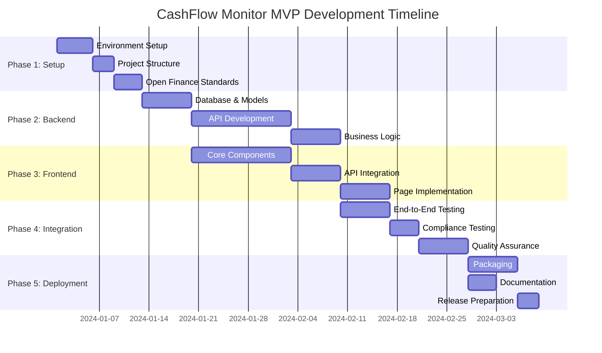

# MVP Roadmap - Personal CashFlow Monitoring Application
## Open Finance Brasil Integration

**Project:** Personal CashFlow Monitoring Application  
**Target:** Minimum Viable Product (MVP)  
**Timeline:** 12-16 weeks  
**Team Size:** 1-3 developers  
**Reference:** Open Finance Brasil Specifications

---

## 🎯 MVP Goals and Success Criteria

### Core MVP Features
- ✅ **Data Import**: CSV/OFX file import with validation
- ✅ **Transaction Management**: CRUD operations with categorization
- ✅ **Basic Analytics**: Spending overview and category breakdown
- ✅ **Budget Tracking**: Simple budget creation and monitoring
- ✅ **Open Finance Brasil Compliance**: Standard categorization and data models
- ✅ **Local Storage**: SQLite database with backup capabilities

### Success Metrics
- **Functional**: All core features working end-to-end
- **Performance**: Handle 10,000+ transactions smoothly
- **Usability**: Intuitive interface with minimal learning curve
- **Compliance**: Full Open Finance Brasil categorization support
- **Stability**: Zero critical bugs, robust error handling

---

## 📅 Development Phases Overview

| Phase | Duration | Description | Deliverables |
|-------|----------|-------------|--------------|
| **Phase 1** | 2-3 weeks | Project Setup & Foundation | Development environment, basic structure |
| **Phase 2** | 3-4 weeks | Backend Development | API, database, core services |
| **Phase 3** | 3-4 weeks | Frontend Development | UI components, user interface |
| **Phase 4** | 2-3 weeks | Integration & Testing | End-to-end functionality |
| **Phase 5** | 1-2 weeks | Deployment & Documentation | Packaged application, user guides |

---

## 🚀 Phase 1: Project Setup & Foundation (Weeks 1-3)

### 1.1 Development Environment Setup
**Duration:** 3-5 days  
**Priority:** Critical  

#### 1.1.1 Backend Environment
- [ ] **Install Python 3.11+** and verify installation
- [ ] **Setup Poetry** for dependency management
- [ ] **Create virtual environment** and activate
- [ ] **Install core dependencies**:
  ```bash
  poetry add fastapi uvicorn sqlalchemy sqlite-db
  poetry add pandas scikit-learn pydantic
  poetry add --group dev pytest black flake8 mypy
  ```
- [ ] **Configure IDE** (VS Code/PyCharm) with Python extensions
- [ ] **Setup pre-commit hooks** for code quality

#### 1.1.2 Frontend Environment
- [ ] **Install Node.js 18+** and npm/yarn
- [ ] **Create React application** with TypeScript
  ```bash
  npx create-react-app frontend --template typescript
  ```
- [ ] **Install dependencies**:
  ```bash
  npm install axios react-query @tanstack/react-table
  npm install tailwindcss chart.js react-chartjs-2
  npm install --save-dev @types/node
  ```
- [ ] **Configure Tailwind CSS** for styling
- [ ] **Setup build tools** and development server

#### 1.1.3 Version Control & Documentation
- [ ] **Initialize Git repository** with proper .gitignore
- [ ] **Create project structure** following architectural decisions
- [ ] **Setup README.md** with setup instructions
- [ ] **Create branch strategy** (main, develop, feature branches)
- [ ] **Document coding standards** and conventions

### 1.2 Project Structure Creation
**Duration:** 2-3 days  
**Priority:** High  

#### 1.2.1 Backend Structure
```
backend/
├── app/
│   ├── __init__.py
│   ├── main.py                 # FastAPI application entry point
│   ├── config.py              # Configuration settings
│   ├── database.py            # Database connection and session
│   ├── api/
│   │   ├── __init__.py
│   │   ├── deps.py            # Dependencies
│   │   └── v1/
│   │       ├── __init__.py
│   │       ├── endpoints/     # API route handlers
│   │       └── router.py      # Main API router
│   ├── core/
│   │   ├── __init__.py
│   │   ├── security.py        # Security utilities
│   │   └── utils.py           # General utilities
│   ├── models/
│   │   ├── __init__.py
│   │   ├── transaction.py     # Transaction model
│   │   ├── category.py        # Category model
│   │   └── budget.py          # Budget model
│   ├── schemas/
│   │   ├── __init__.py
│   │   ├── transaction.py     # Pydantic schemas
│   │   ├── category.py
│   │   └── budget.py
│   └── services/
│       ├── __init__.py
│       ├── transaction_service.py
│       ├── category_service.py
│       └── import_service.py
├── tests/
├── alembic/                   # Database migrations
└── pyproject.toml            # Poetry configuration
```

#### 1.2.2 Frontend Structure
```
frontend/
├── public/
├── src/
│   ├── components/
│   │   ├── common/           # Reusable components
│   │   ├── transactions/     # Transaction-related components
│   │   ├── categories/       # Category management
│   │   └── dashboard/        # Dashboard components
│   ├── services/
│   │   ├── api.ts           # API client configuration
│   │   ├── transactionService.ts
│   │   └── categoryService.ts
│   ├── types/
│   │   ├── transaction.ts    # TypeScript interfaces
│   │   ├── category.ts
│   │   └── api.ts
│   ├── utils/
│   │   ├── formatting.ts     # Data formatting utilities
│   │   └── validation.ts     # Form validation
│   ├── hooks/               # Custom React hooks
│   ├── pages/               # Page components
│   └── App.tsx
├── package.json
└── tailwind.config.js
```

### 1.3 Open Finance Brasil Standards Implementation
**Duration:** 3-4 days  
**Priority:** Critical  

#### 1.3.1 Category Hierarchy Setup
- [ ] **Define category constants** based on Open Finance Brasil specs
- [ ] **Create category data structure**:
  ```python
  # Level 1 Categories (Primary)
  PRIMARY_CATEGORIES = {
      "RECEITAS": "Income",
      "DESPESAS": "Expenses", 
      "TRANSFERENCIAS": "Transfers",
      "INVESTIMENTOS": "Investments"
  }
  
  # Level 2 Categories (Secondary)
  SECONDARY_CATEGORIES = {
      "ALIMENTACAO": "Food & Dining",
      "TRANSPORTE": "Transportation",
      "MORADIA": "Housing",
      "SAUDE": "Healthcare",
      "EDUCACAO": "Education",
      "ENTRETENIMENTO": "Entertainment",
      "COMPRAS": "Shopping",
      "SERVICOS_FINANCEIROS": "Financial Services"
  }
  ```
- [ ] **Implement category validation** functions
- [ ] **Create default category seed data** for database
- [ ] **Document category mapping** strategy

#### 1.3.2 Data Model Alignment
- [ ] **Define transaction schema** following Open Finance Brasil format:
  ```python
  class Transaction(BaseModel):
      id: UUID4
      date: datetime
      amount: Decimal
      description: str
      category_id: UUID4
      transaction_type: TransactionType
      currency: str = "BRL"
      reference_number: Optional[str]
      institution_code: Optional[str]
  ```
- [ ] **Implement currency handling** (BRL formatting)
- [ ] **Create data validation rules** for amounts and dates
- [ ] **Setup database constraints** for data integrity

---

## 🔧 Phase 2: Backend Development (Weeks 4-7)

### 2.1 Database Setup and Models
**Duration:** 1 week  
**Priority:** Critical  

#### 2.1.1 Database Configuration
- [ ] **Setup SQLAlchemy configuration** with SQLite
- [ ] **Create database connection** management
- [ ] **Initialize Alembic** for migrations
- [ ] **Configure database URL** and connection pooling
- [ ] **Setup test database** configuration

#### 2.1.2 Core Models Implementation
- [ ] **Transaction Model**:
  ```python
  class Transaction(Base):
      __tablename__ = "transactions"
      
      id = Column(UUID, primary_key=True, default=uuid4)
      date = Column(Date, nullable=False, index=True)
      amount = Column(Numeric(12, 2), nullable=False)
      description = Column(Text, nullable=False)
      category_id = Column(UUID, ForeignKey("categories.id"))
      account = Column(String(100))
      transaction_type = Column(Enum(TransactionType), nullable=False)
      currency = Column(String(3), default="BRL")
      is_recurring = Column(Boolean, default=False)
      tags = Column(JSON)
      notes = Column(Text)
      reference_number = Column(String(100))
      created_at = Column(DateTime, default=datetime.utcnow)
      updated_at = Column(DateTime, default=datetime.utcnow, onupdate=datetime.utcnow)
      
      # Relationships
      category = relationship("Category", back_populates="transactions")
  ```

- [ ] **Category Model**:
  ```python
  class Category(Base):
      __tablename__ = "categories"
      
      id = Column(UUID, primary_key=True, default=uuid4)
      name = Column(String(100), nullable=False)
      parent_id = Column(UUID, ForeignKey("categories.id"))
      level = Column(Integer, nullable=False)
      color = Column(String(7))  # Hex color
      icon = Column(String(50))
      is_active = Column(Boolean, default=True)
      open_finance_code = Column(String(50))  # Open Finance Brasil code
      created_at = Column(DateTime, default=datetime.utcnow)
      
      # Relationships
      parent = relationship("Category", remote_side=[id])
      children = relationship("Category")
      transactions = relationship("Transaction", back_populates="category")
  ```

- [ ] **Budget Model**:
  ```python
  class Budget(Base):
      __tablename__ = "budgets"
      
      id = Column(UUID, primary_key=True, default=uuid4)
      name = Column(String(100), nullable=False)
      category_id = Column(UUID, ForeignKey("categories.id"))
      amount = Column(Numeric(12, 2), nullable=False)
      period_type = Column(Enum(BudgetPeriod), nullable=False)
      start_date = Column(Date, nullable=False)
      end_date = Column(Date, nullable=False)
      alert_threshold = Column(Numeric(5, 2), default=80.00)
      is_active = Column(Boolean, default=True)
      created_at = Column(DateTime, default=datetime.utcnow)
      
      # Relationships
      category = relationship("Category")
  ```

#### 2.1.3 Database Initialization
- [ ] **Create migration scripts** for all models
- [ ] **Implement database seeding** with Open Finance Brasil categories
- [ ] **Add database indexes** for performance optimization
- [ ] **Create backup/restore utilities**
- [ ] **Test database operations** and constraints

### 2.2 API Development
**Duration:** 2 weeks  
**Priority:** Critical  

#### 2.2.1 Core API Endpoints
- [ ] **Transaction Endpoints**:
  ```python
  # Transaction CRUD operations
  POST   /api/v1/transactions/          # Create transaction
  GET    /api/v1/transactions/          # List transactions (paginated)
  GET    /api/v1/transactions/{id}      # Get transaction by ID
  PUT    /api/v1/transactions/{id}      # Update transaction
  DELETE /api/v1/transactions/{id}      # Delete transaction
  GET    /api/v1/transactions/search    # Search transactions
  ```

- [ ] **Category Endpoints**:
  ```python
  GET    /api/v1/categories/            # List all categories
  POST   /api/v1/categories/            # Create custom category
  PUT    /api/v1/categories/{id}        # Update category
  GET    /api/v1/categories/hierarchy   # Get category tree
  ```

- [ ] **Budget Endpoints**:
  ```python
  POST   /api/v1/budgets/               # Create budget
  GET    /api/v1/budgets/               # List budgets
  GET    /api/v1/budgets/{id}           # Get budget details
  PUT    /api/v1/budgets/{id}           # Update budget
  DELETE /api/v1/budgets/{id}           # Delete budget
  GET    /api/v1/budgets/{id}/progress  # Get budget progress
  ```

#### 2.2.2 Import/Export Endpoints
- [ ] **Data Import**:
  ```python
  POST   /api/v1/import/csv             # Import CSV file
  POST   /api/v1/import/ofx             # Import OFX file
  GET    /api/v1/import/preview         # Preview import data
  POST   /api/v1/import/confirm         # Confirm import operation
  ```

- [ ] **Data Export**:
  ```python
  GET    /api/v1/export/csv             # Export to CSV
  GET    /api/v1/export/excel           # Export to Excel
  POST   /api/v1/export/custom          # Custom export with filters
  ```

#### 2.2.3 Analytics Endpoints
- [ ] **Basic Analytics**:
  ```python
  GET    /api/v1/analytics/summary      # Financial summary
  GET    /api/v1/analytics/categories   # Category breakdown
  GET    /api/v1/analytics/trends       # Spending trends
  GET    /api/v1/analytics/monthly      # Monthly analysis
  ```

### 2.3 Business Logic Services
**Duration:** 1 week  
**Priority:** High  

#### 2.3.1 Transaction Service
- [ ] **CRUD Operations**:
  ```python
  class TransactionService:
      async def create_transaction(self, transaction_data: TransactionCreate)
      async def get_transactions(self, filters: TransactionFilters, pagination: Pagination)
      async def update_transaction(self, transaction_id: UUID, update_data: TransactionUpdate)
      async def delete_transaction(self, transaction_id: UUID)
      async def search_transactions(self, search_criteria: SearchCriteria)
      async def get_transaction_summary(self, date_range: DateRange)
  ```

- [ ] **Auto-categorization Logic**:
  ```python
  class CategorizationService:
      def categorize_transaction(self, description: str, amount: Decimal) -> CategoryPrediction
      def train_categorization_model(self, transactions: List[Transaction])
      def get_categorization_confidence(self, transaction: Transaction) -> float
      def create_categorization_rule(self, rule_data: CategorizationRule)
  ```

#### 2.3.2 Import Service
- [ ] **File Processing**:
  ```python
  class ImportService:
      async def process_csv_file(self, file_content: bytes) -> ImportPreview
      async def process_ofx_file(self, file_content: bytes) -> ImportPreview
      async def validate_import_data(self, transactions: List[TransactionImport]) -> ValidationResult
      async def import_transactions(self, validated_transactions: List[TransactionImport])
      async def detect_duplicates(self, new_transactions: List[Transaction]) -> List[Duplicate]
  ```

#### 2.3.3 Analytics Service
- [ ] **Data Analysis**:
  ```python
  class AnalyticsService:
      async def get_spending_summary(self, date_range: DateRange) -> SpendingSummary
      async def get_category_breakdown(self, period: Period) -> CategoryBreakdown
      async def calculate_trends(self, metric: str, periods: int) -> TrendAnalysis
      async def get_monthly_comparison(self, months: int) -> MonthlyComparison
  ```

---

## 🎨 Phase 3: Frontend Development (Weeks 8-11)

### 3.1 Core Components Development
**Duration:** 2 weeks  
**Priority:** Critical  

#### 3.1.1 Common Components
- [ ] **Layout Components**:
  ```typescript
  // components/common/
  - Header.tsx              // App header with navigation
  - Sidebar.tsx             // Navigation sidebar
  - Layout.tsx              // Main layout wrapper
  - Loading.tsx             // Loading spinner
  - ErrorBoundary.tsx       // Error handling
  ```

- [ ] **UI Components**:
  ```typescript
  // components/common/ui/
  - Button.tsx              // Styled button component
  - Input.tsx               // Form input component
  - Select.tsx              // Dropdown select
  - Modal.tsx               // Modal dialog
  - Table.tsx               // Data table component
  - Card.tsx                // Card container
  - Badge.tsx               // Status badges
  ```

- [ ] **Form Components**:
  ```typescript
  // components/common/forms/
  - FormField.tsx           // Form field wrapper
  - DatePicker.tsx          // Date selection
  - AmountInput.tsx         // Currency amount input
  - CategorySelect.tsx      // Category dropdown
  - FileUpload.tsx          // File upload component
  ```

#### 3.1.2 Transaction Components
- [ ] **Transaction Management**:
  ```typescript
  // components/transactions/
  - TransactionList.tsx     // Paginated transaction table
  - TransactionItem.tsx     // Individual transaction row
  - TransactionForm.tsx     // Add/edit transaction form
  - TransactionDetails.tsx  // Transaction detail view
  - TransactionFilters.tsx  // Search and filter controls
  - BulkActions.tsx         // Bulk operation controls
  ```

- [ ] **Transaction Features**:
  ```typescript
  - QuickAdd.tsx            // Quick transaction entry
  - CategoryAutocomplete.tsx // Smart category suggestions
  - RecurringTransaction.tsx // Recurring transaction setup
  - TransactionSplit.tsx     // Split transaction interface
  ```

#### 3.1.3 Dashboard Components
- [ ] **Dashboard Widgets**:
  ```typescript
  // components/dashboard/
  - DashboardOverview.tsx   // Main dashboard container
  - SummaryCards.tsx        // Financial summary cards
  - SpendingChart.tsx       // Spending visualization
  - CategoryChart.tsx       // Category breakdown chart
  - RecentTransactions.tsx  // Recent transactions widget
  - BudgetProgress.tsx      // Budget progress indicators
  - QuickActions.tsx        // Quick action buttons
  ```

### 3.2 Data Management and API Integration
**Duration:** 1 week  
**Priority:** Critical  

#### 3.2.1 API Client Setup
- [ ] **API Configuration**:
  ```typescript
  // services/api.ts
  class ApiClient {
      private baseURL: string;
      private axiosInstance: AxiosInstance;
      
      constructor(baseURL: string) {
          this.baseURL = baseURL;
          this.axiosInstance = axios.create({
              baseURL,
              timeout: 10000,
              headers: {
                  'Content-Type': 'application/json',
              },
          });
      }
      
      // Request/response interceptors
      setupInterceptors() {
          // Error handling, loading states, etc.
      }
  }
  ```

- [ ] **Service Classes**:
  ```typescript
  // services/transactionService.ts
  class TransactionService {
      async getTransactions(filters?: TransactionFilters): Promise<TransactionListResponse>
      async createTransaction(transaction: CreateTransactionRequest): Promise<Transaction>
      async updateTransaction(id: string, transaction: UpdateTransactionRequest): Promise<Transaction>
      async deleteTransaction(id: string): Promise<void>
      async searchTransactions(query: string): Promise<Transaction[]>
  }
  
  // services/categoryService.ts
  class CategoryService {
      async getCategories(): Promise<Category[]>
      async getCategoryHierarchy(): Promise<CategoryTree>
      async createCategory(category: CreateCategoryRequest): Promise<Category>
  }
  
  // services/importService.ts
  class ImportService {
      async uploadFile(file: File): Promise<ImportPreview>
      async confirmImport(importId: string): Promise<ImportResult>
      async getImportHistory(): Promise<ImportHistory[]>
  }
  ```

#### 3.2.2 State Management with React Query
- [ ] **Query Hooks**:
  ```typescript
  // hooks/useTransactions.ts
  export const useTransactions = (filters?: TransactionFilters) => {
      return useQuery({
          queryKey: ['transactions', filters],
          queryFn: () => transactionService.getTransactions(filters),
          staleTime: 5 * 60 * 1000, // 5 minutes
      });
  };
  
  export const useCreateTransaction = () => {
      const queryClient = useQueryClient();
      return useMutation({
          mutationFn: transactionService.createTransaction,
          onSuccess: () => {
              queryClient.invalidateQueries(['transactions']);
              queryClient.invalidateQueries(['analytics']);
          },
      });
  };
  ```

- [ ] **Custom Hooks**:
  ```typescript
  // hooks/useCategories.ts
  export const useCategories = () => useQuery({
      queryKey: ['categories'],
      queryFn: categoryService.getCategories,
      staleTime: 30 * 60 * 1000, // 30 minutes
  });
  
  // hooks/useAnalytics.ts
  export const useSpendingAnalytics = (dateRange: DateRange) => useQuery({
      queryKey: ['analytics', 'spending', dateRange],
      queryFn: () => analyticsService.getSpendingAnalytics(dateRange),
      staleTime: 10 * 60 * 1000, // 10 minutes
  });
  ```

### 3.3 Page Implementation
**Duration:** 1 week  
**Priority:** High  

#### 3.3.1 Main Pages
- [ ] **Dashboard Page**:
  ```typescript
  // pages/Dashboard.tsx
  const Dashboard: React.FC = () => {
      const { data: summary } = useFinancialSummary();
      const { data: recentTransactions } = useRecentTransactions();
      const { data: budgetProgress } = useBudgetProgress();
      
      return (
          <div className="dashboard-container">
              <SummaryCards data={summary} />
              <div className="dashboard-grid">
                  <SpendingChart />
                  <CategoryChart />
                  <BudgetProgress data={budgetProgress} />
                  <RecentTransactions data={recentTransactions} />
              </div>
          </div>
      );
  };
  ```

- [ ] **Transactions Page**:
  ```typescript
  // pages/Transactions.tsx
  const Transactions: React.FC = () => {
      const [filters, setFilters] = useState<TransactionFilters>({});
      const { data: transactions, isLoading } = useTransactions(filters);
      
      return (
          <div className="transactions-page">
              <div className="page-header">
                  <h1>Transactions</h1>
                  <QuickAdd />
              </div>
              <TransactionFilters filters={filters} onFiltersChange={setFilters} />
              <TransactionList transactions={transactions} loading={isLoading} />
          </div>
      );
  };
  ```

- [ ] **Categories Page**:
  ```typescript
  // pages/Categories.tsx
  const Categories: React.FC = () => {
      const { data: categories } = useCategories();
      const { data: hierarchy } = useCategoryHierarchy();
      
      return (
          <div className="categories-page">
              <CategoryManager categories={categories} hierarchy={hierarchy} />
              <CategorizationRules />
          </div>
      );
  };
  ```

#### 3.3.2 Import/Export Pages
- [ ] **Import Page**:
  ```typescript
  // pages/Import.tsx
  const Import: React.FC = () => {
      const [step, setStep] = useState<ImportStep>('upload');
      const [importData, setImportData] = useState<ImportPreview>();
      
      return (
          <div className="import-page">
              <ImportWizard
                  currentStep={step}
                  onStepChange={setStep}
                  importData={importData}
                  onImportComplete={() => navigate('/transactions')}
              />
          </div>
      );
  };
  ```

---

## 🔗 Phase 4: Integration & Testing (Weeks 12-14)

### 4.1 End-to-End Integration
**Duration:** 1 week  
**Priority:** Critical  

#### 4.1.1 API Integration Testing
- [ ] **Connection Testing**:
  - [ ] Verify frontend-backend communication
  - [ ] Test API endpoint responses
  - [ ] Validate data serialization/deserialization
  - [ ] Check error handling and status codes
  - [ ] Test pagination and filtering

- [ ] **Data Flow Testing**:
  - [ ] Transaction CRUD operations end-to-end
  - [ ] File import workflow complete flow
  - [ ] Category management workflow
  - [ ] Budget creation and monitoring
  - [ ] Analytics data generation and display

#### 4.1.2 Feature Integration
- [ ] **Transaction Categorization**:
  - [ ] Test auto-categorization algorithm
  - [ ] Verify manual category override
  - [ ] Check category hierarchy display
  - [ ] Test bulk categorization operations

- [ ] **Import/Export Workflow**:
  - [ ] CSV file import complete workflow
  - [ ] OFX file processing and validation
  - [ ] Export functionality with various formats
  - [ ] Error handling for malformed files

### 4.2 Open Finance Brasil Compliance Testing
**Duration:** 3-4 days  
**Priority:** Critical  

#### 4.2.1 Category Compliance
- [ ] **Verify Category Hierarchy**:
  ```typescript
  // Test Open Finance Brasil category structure
  describe('Open Finance Brasil Category Compliance', () => {
      test('should have all Level 1 categories', () => {
          const level1Categories = ['RECEITAS', 'DESPESAS', 'TRANSFERENCIAS', 'INVESTIMENTOS'];
          // Test implementation
      });
      
      test('should have proper Level 2 subcategories', () => {
          const level2Categories = ['ALIMENTACAO', 'TRANSPORTE', 'MORADIA', 'SAUDE'];
          // Test implementation
      });
      
      test('should maintain category hierarchy integrity', () => {
          // Test parent-child relationships
      });
  });
  ```

- [ ] **Data Format Validation**:
  ```python
  # Test currency and amount formatting
  def test_brl_currency_formatting():
      transaction = Transaction(amount=Decimal('1234.56'), currency='BRL')
      assert transaction.formatted_amount == 'R$ 1.234,56'
  
  def test_date_format_compliance():
      transaction = Transaction(date=datetime(2024, 1, 15))
      assert transaction.date.isoformat() == '2024-01-15'
  ```

#### 4.2.2 API Standards Testing
- [ ] **RESTful API Compliance**:
  - [ ] Verify HTTP status codes
  - [ ] Check request/response headers
  - [ ] Validate JSON schema compliance
  - [ ] Test pagination parameters
  - [ ] Verify error response format

### 4.3 Quality Assurance Testing
**Duration:** 1 week  
**Priority:** High  

#### 4.3.1 Unit Testing
- [ ] **Backend Unit Tests**:
  ```python
  # Test coverage targets: 80%+
  pytest tests/test_models.py -v --cov=app/models --cov-report=html
  pytest tests/test_services.py -v --cov=app/services
  pytest tests/test_api.py -v --cov=app/api
  ```

- [ ] **Frontend Unit Tests**:
  ```typescript
  // Test component rendering and behavior
  npm test -- --coverage --watchAll=false
  
  // Test custom hooks
  jest src/hooks/ --coverage
  
  // Test utility functions
  jest src/utils/ --coverage
  ```

#### 4.3.2 Integration Testing
- [ ] **Database Integration**:
  - [ ] Test transaction CRUD operations
  - [ ] Verify data integrity constraints
  - [ ] Check migration scripts
  - [ ] Test backup/restore functionality

- [ ] **File Processing Integration**:
  - [ ] Test CSV import with various formats
  - [ ] Test OFX file parsing
  - [ ] Verify duplicate detection
  - [ ] Test large file handling

#### 4.3.3 Performance Testing
- [ ] **Load Testing**:
  ```python
  # Test with large datasets
  def test_large_transaction_import():
      # Import 10,000+ transactions
      # Verify performance metrics
      
  def test_analytics_performance():
      # Generate analytics for large dataset
      # Check response times < 2 seconds
  ```

- [ ] **UI Performance**:
  ```typescript
  // Test component rendering performance
  describe('Performance Tests', () => {
      test('Transaction list renders within 200ms', async () => {
          // Performance testing implementation
      });
  });
  ```

---

## 📦 Phase 5: Deployment & Documentation (Weeks 15-16)

### 5.1 Application Packaging
**Duration:** 1 week  
**Priority:** Critical  

#### 5.1.1 Backend Packaging
- [ ] **Poetry Build Configuration**:
  ```toml
  # pyproject.toml
  [tool.poetry]
  name = "cashflow-app"
  version = "1.0.0"
  description = "Personal CashFlow Monitoring Application"
  
  [build-system]
  requires = ["poetry-core>=1.0.0"]
  build-backend = "poetry.core.masonry.api"
  
  [tool.poetry.scripts]
  cashflow = "app.main:main"
  ```

- [ ] **PyInstaller Configuration**:
  ```python
  # build.spec
  a = Analysis(
      ['app/main.py'],
      pathex=[],
      binaries=[],
      datas=[('frontend/dist', 'frontend/dist')],
      hiddenimports=[],
      hookspath=[],
      hooksconfig={},
      runtime_hooks=[],
      excludes=[],
      win_no_prefer_redirects=False,
      win_private_assemblies=False,
      cipher=None,
      noarchive=False,
  )
  ```

#### 5.1.2 Frontend Build
- [ ] **Production Build**:
  ```json
  // package.json scripts
  {
      "scripts": {
          "build": "vite build",
          "build:prod": "NODE_ENV=production vite build",
          "preview": "vite preview"
      }
  }
  ```

- [ ] **Build Optimization**:
  ```typescript
  // vite.config.ts
  export default defineConfig({
      build: {
          outDir: 'dist',
          sourcemap: false,
          minify: 'terser',
          rollupOptions: {
              output: {
                  manualChunks: {
                      vendor: ['react', 'react-dom'],
                      charts: ['chart.js', 'react-chartjs-2']
                  }
              }
          }
      }
  });
  ```

#### 5.1.3 Desktop Application
- [ ] **Electron Integration** (Optional):
  ```javascript
  // main.js
  const { app, BrowserWindow, shell } = require('electron');
  const path = require('path');
  const { spawn } = require('child_process');
  
  // Start Python backend
  let backendProcess;
  
  function createWindow() {
      const win = new BrowserWindow({
          width: 1200,
          height: 800,
          webPreferences: {
              nodeIntegration: false,
              contextIsolation: true
          }
      });
      
      win.loadURL('http://localhost:8000');
  }
  ```

### 5.2 Documentation Creation
**Duration:** 3-4 days  
**Priority:** High  

#### 5.2.1 User Documentation
- [ ] **Installation Guide**:
  ```markdown
  # Installation Guide
  
  ## System Requirements
  - Windows 10+ / macOS 10.15+ / Linux Ubuntu 20.04+
  - 4GB RAM minimum, 8GB recommended
  - 500MB free disk space
  
  ## Installation Steps
  1. Download the installer for your operating system
  2. Run the installer with administrator privileges
  3. Follow the installation wizard
  4. Launch the application from the desktop shortcut
  ```

- [ ] **User Manual**:
  ```markdown
  # User Manual
  
  ## Getting Started
  ### First Launch
  ### Importing Your Data
  ### Setting Up Categories
  
  ## Core Features
  ### Transaction Management
  ### Budget Creation
  ### Analytics and Reports
  
  ## Advanced Features
  ### Custom Categories
  ### Export Options
  ### Backup and Restore
  ```

- [ ] **FAQ and Troubleshooting**:
  ```markdown
  # Frequently Asked Questions
  
  ## Import Issues
  Q: My CSV file won't import. What formats are supported?
  A: We support CSV files with columns: Date, Amount, Description...
  
  ## Performance
  Q: The application is running slowly with large datasets.
  A: For datasets over 50,000 transactions...
  ```

#### 5.2.2 Technical Documentation
- [ ] **API Documentation**:
  ```python
  # Generate OpenAPI documentation
  from fastapi.openapi.utils import get_openapi
  
  def custom_openapi():
      if app.openapi_schema:
          return app.openapi_schema
      openapi_schema = get_openapi(
          title="CashFlow API",
          version="1.0.0",
          description="Personal CashFlow Monitoring API",
          routes=app.routes,
      )
      app.openapi_schema = openapi_schema
      return app.openapi_schema
  ```

- [ ] **Development Guide**:
  ```markdown
  # Development Guide
  
  ## Setup Development Environment
  ### Backend Setup
  ### Frontend Setup
  ### Database Setup
  
  ## Architecture Overview
  ### Project Structure
  ### Design Patterns
  ### Open Finance Brasil Integration
  
  ## Contributing
  ### Code Standards
  ### Testing Requirements
  ### Pull Request Process
  ```

### 5.3 Release Preparation
**Duration:** 2-3 days  
**Priority:** Critical  

#### 5.3.1 Release Testing
- [ ] **Final QA Testing**:
  - [ ] Fresh installation testing
  - [ ] Import/export workflow validation
  - [ ] Performance benchmarking
  - [ ] Cross-platform compatibility
  - [ ] User acceptance testing

- [ ] **Release Checklist**:
  ```markdown
  ## Pre-Release Checklist
  - [ ] All MVP features implemented and tested
  - [ ] Documentation complete and reviewed
  - [ ] Installation packages built and tested
  - [ ] Performance benchmarks meet requirements
  - [ ] Open Finance Brasil compliance verified
  - [ ] User feedback incorporated
  - [ ] Security review completed
  ```

#### 5.3.2 Deployment Preparation
- [ ] **Release Notes**:
  ```markdown
  # CashFlow Monitor v1.0.0 - MVP Release
  
  ## New Features
  - ✅ Complete transaction management
  - ✅ Smart categorization with Open Finance Brasil standards
  - ✅ Budget tracking and alerts
  - ✅ Financial analytics and insights
  - ✅ CSV/OFX file import
  - ✅ Data export and backup
  
  ## Technical Specifications
  - Local-only operation for maximum privacy
  - Support for 100,000+ transactions
  - Desktop-optimized interface
  - Full Open Finance Brasil compliance
  ```

- [ ] **Distribution Setup**:
  - [ ] Create installer packages for Windows/macOS/Linux
  - [ ] Setup download page with system requirements
  - [ ] Prepare support channels and documentation links
  - [ ] Create backup and recovery procedures

---

## 📊 Timeline and Resource Allocation

### Development Timeline


### Resource Requirements

#### Team Composition (Recommended)
- **Full-Stack Developer**: 1 person (primary developer)
- **Frontend Specialist**: 0.5 person (UI/UX focus)
- **QA Engineer**: 0.5 person (testing and validation)

#### Time Allocation by Role
```
Full-Stack Developer (100% allocation):
- Phase 1: 100% (2-3 weeks)
- Phase 2: 100% (3-4 weeks)  
- Phase 3: 50% (parallel with frontend specialist)
- Phase 4: 100% (2-3 weeks)
- Phase 5: 100% (1-2 weeks)

Frontend Specialist (50% allocation):
- Phase 3: 100% (2 weeks focused frontend work)
- Phase 4: 50% (frontend testing support)

QA Engineer (25% allocation):
- Phase 2: 25% (early testing setup)
- Phase 4: 100% (intensive testing period)
- Phase 5: 50% (release validation)
```

---

## ⚡ Critical Success Factors

### 1. Open Finance Brasil Compliance
- **Priority**: Critical
- **Risk**: High - Non-compliance could affect market adoption
- **Mitigation**: Early implementation of standards, regular compliance validation

### 2. Data Import Reliability
- **Priority**: Critical  
- **Risk**: Medium - File format variations could cause import failures
- **Mitigation**: Comprehensive file format testing, robust error handling

### 3. Performance with Large Datasets
- **Priority**: High
- **Risk**: Medium - Poor performance could impact user experience
- **Mitigation**: Database optimization, efficient algorithms, performance testing

### 4. User Experience Quality
- **Priority**: High
- **Risk**: Medium - Poor UX could lead to low adoption
- **Mitigation**: User-centered design, iterative feedback, usability testing

---

## 🎯 MVP Success Criteria

### Functional Requirements ✅
- [ ] Import 10,000+ transactions from CSV/OFX files in under 60 seconds
- [ ] Automatically categorize 80%+ of transactions correctly
- [ ] Display transaction lists and analytics in under 2 seconds
- [ ] Create and monitor budgets with real-time progress updates
- [ ] Export data in multiple formats (CSV, Excel, PDF)
- [ ] Maintain 100% Open Finance Brasil category compliance

### Technical Requirements ✅
- [ ] Support SQLite database with 100,000+ transactions
- [ ] Achieve 80%+ code coverage with automated tests
- [ ] Package as standalone desktop application
- [ ] Implement proper error handling and user feedback
- [ ] Ensure data backup and recovery capabilities

### User Experience Requirements ✅
- [ ] Complete user onboarding within 30 minutes
- [ ] Intuitive interface requiring minimal learning curve
- [ ] Keyboard shortcuts for power users
- [ ] Responsive desktop interface (1366x768 minimum)
- [ ] Clear documentation and help system

This comprehensive roadmap provides a structured approach to developing your Personal CashFlow Monitoring Application MVP with full Open Finance Brasil integration. The timeline is realistic for a small development team while ensuring high-quality deliverables and regulatory compliance.
