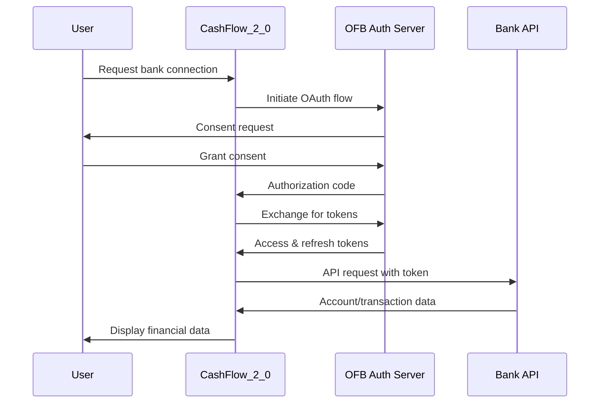

# Open Finance Brasil API Integration Guide
## CashFlow_2_0 Implementation Specification

### Overview

This document provides detailed API integration specifications for connecting CashFlow_2_0 with Open Finance Brasil ecosystem participants. It covers authentication, data exchange, security requirements, and implementation examples.

**Reference**: [Open Finance Brasil Developer Portal](https://openfinancebrasil.atlassian.net/wiki/spaces/OF/overview?homepageId=17367041)

---

## 1. API Integration Architecture

### 1.1 Integration Flow



### 1.2 Core Components

```python
# Open Finance Brasil Integration Module
class OpenFinanceBrasilIntegration:
    """Core integration class for OFB APIs"""
    
    def __init__(self):
        self.auth_client = OAuthClient()
        self.api_client = APIClient()
        self.certificate_manager = CertificateManager()
        self.consent_manager = ConsentManager()
```

---

## 2. Authentication and Authorization

### 2.1 OAuth 2.0 + FAPI Implementation

```python
from fastapi import FastAPI, Depends, HTTPException
from fastapi.security import OAuth2AuthorizationCodeBearer
import httpx
import jwt
from cryptography import x509

class OFBAuthenticator:
    """Open Finance Brasil OAuth 2.0 + FAPI Authenticator"""
    
    def __init__(self):
        self.oauth_scheme = OAuth2AuthorizationCodeBearer(
            authorizationUrl="https://auth.openfinancebrasil.org.br/oauth2/authorize",
            tokenUrl="https://auth.openfinancebrasil.org.br/oauth2/token",
            scopes={
                "accounts": "Access account information",
                "transactions": "Access transaction history", 
                "payments": "Initiate payments",
                "consents": "Manage consents"
            }
        )
    
    async def get_authorization_url(self, 
                                  client_id: str,
                                  redirect_uri: str,
                                  scopes: list[str],
                                  state: str) -> str:
        """Generate OFB-compliant authorization URL"""
        
        # PKCE parameters (required by FAPI)
        code_verifier = self._generate_code_verifier()
        code_challenge = self._generate_code_challenge(code_verifier)
        
        # Request object signing (FAPI requirement)
        request_object = await self._create_signed_request_object({
            "client_id": client_id,
            "redirect_uri": redirect_uri,
            "scope": " ".join(scopes),
            "state": state,
            "code_challenge": code_challenge,
            "code_challenge_method": "S256",
            "response_type": "code"
        })
        
        auth_url = (
            f"https://auth.openfinancebrasil.org.br/oauth2/authorize"
            f"?client_id={client_id}"
            f"&redirect_uri={redirect_uri}"
            f"&scope={' '.join(scopes)}"
            f"&state={state}"
            f"&code_challenge={code_challenge}"
            f"&code_challenge_method=S256"
            f"&response_type=code"
            f"&request={request_object}"
        )
        
        return auth_url
    
    async def exchange_code_for_tokens(self,
                                     code: str,
                                     client_id: str,
                                     client_secret: str,
                                     redirect_uri: str,
                                     code_verifier: str) -> dict:
        """Exchange authorization code for access tokens"""
        
        # Prepare token request with MTLS
        token_data = {
            "grant_type": "authorization_code",
            "code": code,
            "client_id": client_id,
            "client_secret": client_secret,
            "redirect_uri": redirect_uri,
            "code_verifier": code_verifier
        }
        
        # Use MTLS client certificate
        async with httpx.AsyncClient(
            cert=(self.client_cert_path, self.client_key_path),
            verify=self.ca_bundle_path
        ) as client:
            response = await client.post(
                "https://auth.openfinancebrasil.org.br/oauth2/token",
                data=token_data,
                headers={
                    "Content-Type": "application/x-www-form-urlencoded",
                    "Accept": "application/json"
                }
            )
        
        if response.status_code != 200:
            raise HTTPException(
                status_code=response.status_code,
                detail=f"Token exchange failed: {response.text}"
            )
        
        tokens = response.json()
        
        # Validate certificate-bound access token
        await self._validate_certificate_bound_token(tokens["access_token"])
        
        return tokens
    
    async def _create_signed_request_object(self, claims: dict) -> str:
        """Create and sign JWT request object (FAPI requirement)"""
        
        # Load signing certificate
        with open(self.signing_cert_path, 'rb') as f:
            signing_cert = x509.load_pem_x509_certificate(f.read())
        
        # Create JWT
        request_jwt = jwt.encode(
            payload=claims,
            key=self.signing_private_key,
            algorithm="RS256",
            headers={"x5c": [signing_cert]}
        )
        
        return request_jwt
```

### 2.2 Consent Management

```python
class ConsentManager:
    """Manage Open Finance Brasil consent lifecycle"""
    
    async def create_consent(self,
                           user_id: str,
                           permissions: list[str],
                           expiration_date: datetime,
                           transaction_from_date: datetime = None,
                           transaction_to_date: datetime = None) -> dict:
        """Create new consent request"""
        
        consent_data = {
            "data": {
                "permissions": permissions,
                "expirationDateTime": expiration_date.isoformat(),
                "transactionFromDateTime": transaction_from_date.isoformat() if transaction_from_date else None,
                "transactionToDateTime": transaction_to_date.isoformat() if transaction_to_date else None,
                "loggedUser": {
                    "document": {
                        "identification": user_id,
                        "rel": "CPF"
                    }
                }
            }
        }
        
        async with self._get_authenticated_client() as client:
            response = await client.post(
                f"{self.base_url}/consents",
                json=consent_data,
                headers=self._get_standard_headers()
            )
        
        if response.status_code != 201:
            raise HTTPException(
                status_code=response.status_code,
                detail=f"Consent creation failed: {response.text}"
            )
        
        consent = response.json()
        
        # Store consent locally
        await self._store_consent_locally(consent)
        
        return consent
    
    async def get_consent(self, consent_id: str) -> dict:
        """Retrieve consent information"""
        
        async with self._get_authenticated_client() as client:
            response = await client.get(
                f"{self.base_url}/consents/{consent_id}",
                headers=self._get_standard_headers()
            )
        
        if response.status_code != 200:
            raise HTTPException(
                status_code=response.status_code,
                detail=f"Consent retrieval failed: {response.text}"
            )
        
        return response.json()
    
    async def revoke_consent(self, consent_id: str) -> bool:
        """Revoke existing consent"""
        
        async with self._get_authenticated_client() as client:
            response = await client.delete(
                f"{self.base_url}/consents/{consent_id}",
                headers=self._get_standard_headers()
            )
        
        if response.status_code != 204:
            raise HTTPException(
                status_code=response.status_code,
                detail=f"Consent revocation failed: {response.text}"
            )
        
        # Remove from local storage
        await self._remove_consent_locally(consent_id)
        
        return True
```

---

## 3. Account Information APIs

### 3.1 Account Discovery and Details

```python
class AccountInformationAPI:
    """Open Finance Brasil Account Information APIs"""
    
    async def get_accounts(self, consent_id: str) -> list[dict]:
        """Retrieve list of accounts"""
        
        async with self._get_authenticated_client(consent_id) as client:
            response = await client.get(
                f"{self.base_url}/accounts",
                headers=self._get_standard_headers(consent_id)
            )
        
        if response.status_code != 200:
            raise HTTPException(
                status_code=response.status_code,
                detail=f"Account retrieval failed: {response.text}"
            )
        
        accounts_data = response.json()
        
        # Transform to CashFlow_2_0 format
        transformed_accounts = []
        for account in accounts_data["data"]:
            transformed_accounts.append({
                "id": account["accountId"],
                "type": account["type"],
                "subtype": account["subtype"],
                "currency": account["currency"],
                "brand_name": account.get("brandName"),
                "company_cnpj": account.get("companyCnpj"),
                "number": account.get("number"),
                "check_digit": account.get("checkDigit"),
                "agency_number": account.get("agencyNumber"),
                "agency_check_digit": account.get("agencyCheckDigit")
            })
        
        return transformed_accounts
    
    async def get_account_balances(self, 
                                 account_id: str, 
                                 consent_id: str) -> dict:
        """Retrieve account balance information"""
        
        async with self._get_authenticated_client(consent_id) as client:
            response = await client.get(
                f"{self.base_url}/accounts/{account_id}/balances",
                headers=self._get_standard_headers(consent_id)
            )
        
        if response.status_code != 200:
            raise HTTPException(
                status_code=response.status_code,
                detail=f"Balance retrieval failed: {response.text}"
            )
        
        balance_data = response.json()
        
        # Transform to CashFlow_2_0 format
        balance = balance_data["data"]
        return {
            "available_amount": Decimal(balance["availableAmount"]),
            "available_amount_currency": balance["availableAmountCurrency"],
            "blocked_amount": Decimal(balance.get("blockedAmount", "0")),
            "blocked_amount_currency": balance.get("blockedAmountCurrency", "BRL"),
            "automatically_invested_amount": Decimal(balance.get("automaticallyInvestedAmount", "0")),
            "automatically_invested_amount_currency": balance.get("automaticallyInvestedAmountCurrency", "BRL")
        }
    
    async def get_account_transactions(self,
                                     account_id: str,
                                     consent_id: str,
                                     from_date: date = None,
                                     to_date: date = None,
                                     page_size: int = 25,
                                     page: int = 1) -> dict:
        """Retrieve account transactions"""
        
        params = {
            "page": page,
            "page-size": page_size
        }
        
        if from_date:
            params["fromBookingDate"] = from_date.isoformat()
        if to_date:
            params["toBookingDate"] = to_date.isoformat()
        
        async with self._get_authenticated_client(consent_id) as client:
            response = await client.get(
                f"{self.base_url}/accounts/{account_id}/transactions",
                params=params,
                headers=self._get_standard_headers(consent_id)
            )
        
        if response.status_code != 200:
            raise HTTPException(
                status_code=response.status_code,
                detail=f"Transaction retrieval failed: {response.text}"
            )
        
        transactions_data = response.json()
        
        # Transform to CashFlow_2_0 format
        transformed_transactions = []
        for txn in transactions_data["data"]:
            # Auto-categorize using our categorization service
            category = await self.categorization_service.suggest_category(
                txn["creditDebitType"],
                txn.get("transactionName", ""),
                float(txn["amount"])
            )
            
            transformed_transactions.append({
                "external_id": txn["transactionId"],
                "date": datetime.fromisoformat(txn["bookingDate"]).date(),
                "amount": Decimal(txn["amount"]) if txn["creditDebitType"] == "CREDITO" else -Decimal(txn["amount"]),
                "description": txn.get("transactionName", txn.get("referenceNumber", "")),
                "transaction_type": self._map_transaction_type(txn["creditDebitType"]),
                "category_id": category.id if category else None,
                "account": account_id,
                "currency": txn["currency"],
                "country_code": "BR",
                "reference_number": txn.get("referenceNumber"),
                "is_recurring": False,  # To be determined by our analysis
                "tags": self._extract_tags(txn),
                "notes": self._extract_notes(txn)
            })
        
        return {
            "transactions": transformed_transactions,
            "pagination": {
                "total": transactions_data["meta"]["totalRecords"],
                "page": transactions_data["meta"]["totalPages"],
                "size": page_size,
                "pages": transactions_data["meta"]["totalPages"]
            }
        }
    
    def _map_transaction_type(self, credit_debit_type: str) -> str:
        """Map OFB credit/debit type to CashFlow_2_0 transaction type"""
        mapping = {
            "CREDITO": "RECEITA",
            "DEBITO": "DESPESA"
        }
        return mapping.get(credit_debit_type, "OUTROS")
    
    def _extract_tags(self, transaction: dict) -> list[str]:
        """Extract relevant tags from transaction data"""
        tags = []
        
        if transaction.get("type"):
            tags.append(transaction["type"])
        
        if transaction.get("transactionCategory"):
            tags.append(transaction["transactionCategory"])
        
        return tags
    
    def _extract_notes(self, transaction: dict) -> str:
        """Extract additional notes from transaction data"""
        notes_parts = []
        
        if transaction.get("referenceNumber"):
            notes_parts.append(f"Ref: {transaction['referenceNumber']}")
        
        if transaction.get("type"):
            notes_parts.append(f"Type: {transaction['type']}")
        
        return " | ".join(notes_parts) if notes_parts else None
```

---

## 4. Payment Initiation APIs

### 4.1 PIX Payment Integration

```python
class PaymentInitiationAPI:
    """Open Finance Brasil Payment Initiation APIs"""
    
    async def create_pix_payment(self,
                               consent_id: str,
                               payment_data: dict) -> dict:
        """Initiate PIX payment"""
        
        # Validate payment data
        await self._validate_pix_payment_data(payment_data)
        
        # Create payment request
        pix_payment = {
            "data": {
                "localInstrument": "MANU",  # Manual initiation
                "payment": {
                    "amount": payment_data["amount"],
                    "currency": "BRL"
                },
                "creditorAccount": {
                    "ispb": payment_data["creditor_ispb"],
                    "number": payment_data["creditor_account"],
                    "accountType": payment_data["creditor_account_type"]
                },
                "remittanceInformation": payment_data.get("description", ""),
                "qrCode": payment_data.get("qr_code"),
                "proxy": payment_data.get("pix_key"),
                "cnpjInitiator": self.company_cnpj
            }
        }
        
        async with self._get_authenticated_client(consent_id) as client:
            response = await client.post(
                f"{self.base_url}/pix/payments",
                json=pix_payment,
                headers=self._get_standard_headers(consent_id)
            )
        
        if response.status_code != 201:
            raise HTTPException(
                status_code=response.status_code,
                detail=f"PIX payment creation failed: {response.text}"
            )
        
        payment_response = response.json()
        
        # Store payment locally for tracking
        await self._store_payment_locally(payment_response)
        
        return payment_response
    
    async def get_pix_payment_status(self,
                                   payment_id: str,
                                   consent_id: str) -> dict:
        """Get PIX payment status"""
        
        async with self._get_authenticated_client(consent_id) as client:
            response = await client.get(
                f"{self.base_url}/pix/payments/{payment_id}",
                headers=self._get_standard_headers(consent_id)
            )
        
        if response.status_code != 200:
            raise HTTPException(
                status_code=response.status_code,
                detail=f"PIX payment status retrieval failed: {response.text}"
            )
        
        return response.json()
    
    async def _validate_pix_payment_data(self, payment_data: dict):
        """Validate PIX payment data"""
        required_fields = ["amount", "creditor_ispb", "creditor_account", "creditor_account_type"]
        
        for field in required_fields:
            if field not in payment_data:
                raise ValueError(f"Missing required field: {field}")
        
        # Validate amount
        if not isinstance(payment_data["amount"], (int, float, Decimal)):
            raise ValueError("Amount must be a valid number")
        
        if Decimal(str(payment_data["amount"])) <= 0:
            raise ValueError("Amount must be positive")
        
        # Validate account type
        valid_account_types = ["CACC", "SLRY", "SVGS", "TRAN"]
        if payment_data["creditor_account_type"] not in valid_account_types:
            raise ValueError(f"Invalid account type. Must be one of: {valid_account_types}")
```

---

## 5. Error Handling and Monitoring

### 5.1 Standardized Error Handling

```python
class OFBErrorHandler:
    """Open Finance Brasil standardized error handling"""
    
    OFB_ERROR_CODES = {
        "INVALID_CLIENT": "Invalid client credentials",
        "INVALID_GRANT": "Invalid authorization grant",
        "UNSUPPORTED_GRANT_TYPE": "Unsupported grant type",
        "INVALID_SCOPE": "Invalid scope",
        "INVALID_CONSENT": "Invalid or expired consent",
        "CONSENT_REVOKED": "Consent has been revoked",
        "INSUFFICIENT_PRIVILEGES": "Insufficient privileges",
        "RATE_LIMIT_EXCEEDED": "Rate limit exceeded",
        "RESOURCE_NOT_FOUND": "Requested resource not found",
        "INVALID_SIGNATURE": "Invalid request signature",
        "CERTIFICATE_ERROR": "Certificate validation error"
    }
    
    async def handle_api_error(self, response: httpx.Response) -> None:
        """Handle OFB API error responses"""
        
        if response.status_code == 200:
            return
        
        try:
            error_data = response.json()
        except:
            error_data = {"errors": [{"code": "UNKNOWN_ERROR", "detail": response.text}]}
        
        # Log error for monitoring
        await self._log_api_error(response, error_data)
        
        # Transform to standard format
        if "errors" in error_data:
            primary_error = error_data["errors"][0]
            error_code = primary_error.get("code", "UNKNOWN_ERROR")
            error_detail = primary_error.get("detail", "An unknown error occurred")
        else:
            error_code = "UNKNOWN_ERROR"
            error_detail = "An unknown error occurred"
        
        # Map to HTTP exception
        status_code_mapping = {
            400: [
                "INVALID_CLIENT", "INVALID_GRANT", "UNSUPPORTED_GRANT_TYPE",
                "INVALID_SCOPE", "INVALID_SIGNATURE"
            ],
            401: ["INVALID_CONSENT", "CONSENT_REVOKED", "CERTIFICATE_ERROR"],
            403: ["INSUFFICIENT_PRIVILEGES"],
            404: ["RESOURCE_NOT_FOUND"],
            429: ["RATE_LIMIT_EXCEEDED"]
        }
        
        http_status = response.status_code
        for status, codes in status_code_mapping.items():
            if error_code in codes:
                http_status = status
                break
        
        raise HTTPException(
            status_code=http_status,
            detail={
                "error_code": error_code,
                "error_description": self.OFB_ERROR_CODES.get(error_code, error_detail),
                "error_detail": error_detail,
                "timestamp": datetime.utcnow().isoformat(),
                "request_id": response.headers.get("x-request-id")
            }
        )
    
    async def _log_api_error(self, response: httpx.Response, error_data: dict):
        """Log API error for monitoring and debugging"""
        
        log_entry = {
            "timestamp": datetime.utcnow().isoformat(),
            "url": str(response.url),
            "method": response.request.method,
            "status_code": response.status_code,
            "error_data": error_data,
            "request_id": response.headers.get("x-request-id"),
            "headers": dict(response.headers)
        }
        
        # Store in monitoring system
        await self.monitoring_service.log_error(log_entry)
```

### 5.2 API Performance Monitoring

```python
class OFBMonitoringService:
    """Monitor Open Finance Brasil API performance"""
    
    def __init__(self):
        self.metrics = {
            "request_count": 0,
            "error_count": 0,
            "average_response_time": 0,
            "rate_limit_hits": 0
        }
    
    async def record_api_call(self,
                            endpoint: str,
                            method: str,
                            response_time: float,
                            status_code: int):
        """Record API call metrics"""
        
        self.metrics["request_count"] += 1
        
        # Update average response time
        total_time = self.metrics["average_response_time"] * (self.metrics["request_count"] - 1)
        self.metrics["average_response_time"] = (total_time + response_time) / self.metrics["request_count"]
        
        # Record errors
        if status_code >= 400:
            self.metrics["error_count"] += 1
        
        # Record rate limit hits
        if status_code == 429:
            self.metrics["rate_limit_hits"] += 1
        
        # Store detailed metrics
        await self._store_detailed_metrics({
            "timestamp": datetime.utcnow(),
            "endpoint": endpoint,
            "method": method,
            "response_time": response_time,
            "status_code": status_code
        })
    
    async def get_health_status(self) -> dict:
        """Get overall API health status"""
        
        error_rate = (self.metrics["error_count"] / max(self.metrics["request_count"], 1)) * 100
        
        health_status = "healthy"
        if error_rate > 5:
            health_status = "degraded"
        if error_rate > 15 or self.metrics["average_response_time"] > 5000:
            health_status = "unhealthy"
        
        return {
            "status": health_status,
            "metrics": self.metrics,
            "error_rate": f"{error_rate:.2f}%",
            "last_updated": datetime.utcnow().isoformat()
        }
```

---

## 6. Implementation Examples

### 6.1 Complete Bank Integration Flow

```python
from fastapi import APIRouter, Depends, BackgroundTasks
from typing import List

router = APIRouter(prefix="/api/v1/open-finance", tags=["Open Finance Brasil"])

@router.post("/connect-bank")
async def connect_bank(
    bank_code: str,
    permissions: List[str],
    background_tasks: BackgroundTasks,
    current_user: User = Depends(get_current_user)
):
    """Connect to bank via Open Finance Brasil"""
    
    try:
        # 1. Create consent
        consent = await consent_manager.create_consent(
            user_id=current_user.cpf,
            permissions=permissions,
            expiration_date=datetime.utcnow() + timedelta(days=90)
        )
        
        # 2. Generate authorization URL
        auth_url = await authenticator.get_authorization_url(
            client_id=settings.ofb_client_id,
            redirect_uri=settings.ofb_redirect_uri,
            scopes=permissions,
            state=f"user_{current_user.id}_consent_{consent['data']['consentId']}"
        )
        
        return {
            "authorization_url": auth_url,
            "consent_id": consent["data"]["consentId"],
            "expires_at": consent["data"]["expirationDateTime"]
        }
        
    except Exception as e:
        raise HTTPException(
            status_code=500,
            detail=f"Failed to initiate bank connection: {str(e)}"
        )

@router.get("/callback")
async def oauth_callback(
    code: str,
    state: str,
    background_tasks: BackgroundTasks
):
    """Handle OAuth callback from bank"""
    
    try:
        # Parse state
        user_id, consent_id = _parse_state(state)
        
        # Exchange code for tokens
        tokens = await authenticator.exchange_code_for_tokens(
            code=code,
            client_id=settings.ofb_client_id,
            client_secret=settings.ofb_client_secret,
            redirect_uri=settings.ofb_redirect_uri,
            code_verifier=_get_stored_code_verifier(state)
        )
        
        # Store tokens securely
        await _store_tokens(user_id, consent_id, tokens)
        
        # Schedule initial data sync
        background_tasks.add_task(
            sync_bank_data,
            user_id=user_id,
            consent_id=consent_id
        )
        
        return {
            "status": "connected",
            "consent_id": consent_id,
            "access_token_expires_at": tokens.get("expires_in", 3600)
        }
        
    except Exception as e:
        raise HTTPException(
            status_code=500,
            detail=f"OAuth callback failed: {str(e)}"
        )

@router.post("/sync-data/{consent_id}")
async def sync_bank_data(
    consent_id: str,
    background_tasks: BackgroundTasks,
    current_user: User = Depends(get_current_user)
):
    """Synchronize data from connected bank"""
    
    try:
        # Get accounts
        accounts = await account_api.get_accounts(consent_id)
        
        sync_results = []
        for account in accounts:
            # Get account balances
            balances = await account_api.get_account_balances(
                account["id"], consent_id
            )
            
            # Get recent transactions
            transactions = await account_api.get_account_transactions(
                account_id=account["id"],
                consent_id=consent_id,
                from_date=datetime.utcnow().date() - timedelta(days=30)
            )
            
            # Import to local database
            imported_count = await import_transactions_to_db(
                user_id=current_user.id,
                account_id=account["id"],
                transactions=transactions["transactions"]
            )
            
            sync_results.append({
                "account_id": account["id"],
                "account_type": account["type"],
                "balance": balances["available_amount"],
                "transactions_imported": imported_count
            })
        
        return {
            "status": "completed",
            "accounts_synced": len(accounts),
            "results": sync_results,
            "sync_timestamp": datetime.utcnow().isoformat()
        }
        
    except Exception as e:
        raise HTTPException(
            status_code=500,
            detail=f"Data synchronization failed: {str(e)}"
        )

@router.delete("/disconnect/{consent_id}")
async def disconnect_bank(
    consent_id: str,
    current_user: User = Depends(get_current_user)
):
    """Disconnect bank and revoke consent"""
    
    try:
        # Revoke consent with bank
        await consent_manager.revoke_consent(consent_id)
        
        # Remove stored tokens
        await _remove_stored_tokens(current_user.id, consent_id)
        
        # Mark local data as disconnected
        await _mark_account_disconnected(current_user.id, consent_id)
        
        return {
            "status": "disconnected",
            "consent_id": consent_id,
            "disconnected_at": datetime.utcnow().isoformat()
        }
        
    except Exception as e:
        raise HTTPException(
            status_code=500,
            detail=f"Bank disconnection failed: {str(e)}"
        )
```

---

## 7. Security Best Practices

### 7.1 Certificate Management

```python
class CertificateManager:
    """Manage Open Finance Brasil certificates"""
    
    def __init__(self):
        self.cert_store = CertificateStore()
        
    async def load_certificates(self):
        """Load and validate certificates"""
        
        # Transport certificate for MTLS
        self.transport_cert = await self._load_certificate(
            cert_path=settings.transport_cert_path,
            key_path=settings.transport_key_path,
            cert_type="transport"
        )
        
        # Signing certificate for request objects
        self.signing_cert = await self._load_certificate(
            cert_path=settings.signing_cert_path,
            key_path=settings.signing_key_path,
            cert_type="signing"
        )
        
        # Validate certificates
        await self._validate_certificates()
    
    async def _validate_certificates(self):
        """Validate certificate compliance"""
        
        # Check expiration
        for cert_name, cert in [
            ("transport", self.transport_cert),
            ("signing", self.signing_cert)
        ]:
            if cert.not_valid_after < datetime.utcnow():
                raise ValueError(f"{cert_name} certificate expired")
            
            # Check remaining validity
            days_remaining = (cert.not_valid_after - datetime.utcnow()).days
            if days_remaining < 30:
                logger.warning(f"{cert_name} certificate expires in {days_remaining} days")
        
        # Validate certificate chain
        await self._validate_certificate_chain()
    
    async def get_certificate_info(self) -> dict:
        """Get certificate information for monitoring"""
        
        return {
            "transport_cert": {
                "subject": str(self.transport_cert.subject),
                "issuer": str(self.transport_cert.issuer),
                "expires_at": self.transport_cert.not_valid_after.isoformat(),
                "serial_number": str(self.transport_cert.serial_number)
            },
            "signing_cert": {
                "subject": str(self.signing_cert.subject),
                "issuer": str(self.signing_cert.issuer),
                "expires_at": self.signing_cert.not_valid_after.isoformat(),
                "serial_number": str(self.signing_cert.serial_number)
            }
        }
```

### 7.2 Token Security

```python
class TokenManager:
    """Secure token management for OFB integration"""
    
    def __init__(self):
        self.encryption_key = Fernet.generate_key()
        self.cipher_suite = Fernet(self.encryption_key)
    
    async def store_tokens(self,
                         user_id: str,
                         consent_id: str,
                         tokens: dict):
        """Securely store access tokens"""
        
        # Encrypt sensitive token data
        encrypted_access_token = self._encrypt_token(tokens["access_token"])
        encrypted_refresh_token = self._encrypt_token(tokens.get("refresh_token"))
        
        # Store with metadata
        token_record = {
            "user_id": user_id,
            "consent_id": consent_id,
            "access_token": encrypted_access_token,
            "refresh_token": encrypted_refresh_token,
            "token_type": tokens.get("token_type", "Bearer"),
            "expires_at": datetime.utcnow() + timedelta(seconds=tokens.get("expires_in", 3600)),
            "scope": tokens.get("scope"),
            "created_at": datetime.utcnow()
        }
        
        await self.db.execute(
            "INSERT INTO ofb_tokens (...) VALUES (...)",
            token_record
        )
    
    async def get_valid_token(self,
                            user_id: str,
                            consent_id: str) -> str:
        """Get valid access token, refreshing if necessary"""
        
        token_record = await self._get_token_record(user_id, consent_id)
        
        if not token_record:
            raise ValueError("No token found for consent")
        
        # Check if token is expired
        if token_record["expires_at"] < datetime.utcnow():
            # Attempt to refresh
            if token_record["refresh_token"]:
                new_tokens = await self._refresh_token(
                    token_record["refresh_token"]
                )
                await self.store_tokens(user_id, consent_id, new_tokens)
                return new_tokens["access_token"]
            else:
                raise ValueError("Token expired and no refresh token available")
        
        # Decrypt and return access token
        return self._decrypt_token(token_record["access_token"])
    
    def _encrypt_token(self, token: str) -> str:
        """Encrypt token for storage"""
        return self.cipher_suite.encrypt(token.encode()).decode()
    
    def _decrypt_token(self, encrypted_token: str) -> str:
        """Decrypt token from storage"""
        return self.cipher_suite.decrypt(encrypted_token.encode()).decode()
```

---

## 8. Testing and Validation

### 8.1 Integration Tests

```python
import pytest
from unittest.mock import Mock, AsyncMock

class TestOFBIntegration:
    """Test Open Finance Brasil integration"""
    
    @pytest.fixture
    async def ofb_client(self):
        """Create OFB client for testing"""
        client = OpenFinanceBrasilIntegration()
        client.auth_client = Mock()
        client.api_client = AsyncMock()
        return client
    
    async def test_consent_creation(self, ofb_client):
        """Test consent creation flow"""
        
        # Mock consent response
        mock_consent = {
            "data": {
                "consentId": "test-consent-123",
                "permissions": ["accounts", "transactions"],
                "expirationDateTime": "2024-04-15T10:30:00Z",
                "status": "AWAITING_AUTHORISATION"
            }
        }
        
        ofb_client.api_client.post.return_value.json.return_value = mock_consent
        ofb_client.api_client.post.return_value.status_code = 201
        
        # Test consent creation
        consent = await ofb_client.consent_manager.create_consent(
            user_id="12345678901",
            permissions=["accounts", "transactions"],
            expiration_date=datetime(2024, 4, 15, 10, 30, 0)
        )
        
        assert consent["data"]["consentId"] == "test-consent-123"
        assert consent["data"]["status"] == "AWAITING_AUTHORISATION"
    
    async def test_account_retrieval(self, ofb_client):
        """Test account information retrieval"""
        
        # Mock accounts response
        mock_accounts = {
            "data": [
                {
                    "accountId": "account-123",
                    "type": "CACC",
                    "subtype": "CURRENT_ACCOUNT",
                    "currency": "BRL",
                    "brandName": "Test Bank",
                    "companyCnpj": "12345678000100"
                }
            ],
            "meta": {
                "totalRecords": 1,
                "totalPages": 1
            }
        }
        
        ofb_client.api_client.get.return_value.json.return_value = mock_accounts
        ofb_client.api_client.get.return_value.status_code = 200
        
        # Test account retrieval
        accounts = await ofb_client.account_api.get_accounts("test-consent-123")
        
        assert len(accounts) == 1
        assert accounts[0]["id"] == "account-123"
        assert accounts[0]["type"] == "CACC"
        assert accounts[0]["currency"] == "BRL"
    
    async def test_transaction_import(self, ofb_client):
        """Test transaction import and categorization"""
        
        # Mock transactions response
        mock_transactions = {
            "data": [
                {
                    "transactionId": "txn-123",
                    "bookingDate": "2024-01-15",
                    "amount": "150.50",
                    "currency": "BRL",
                    "creditDebitType": "DEBITO",
                    "transactionName": "RESTAURANTE ABC",
                    "referenceNumber": "REF123456"
                }
            ],
            "meta": {
                "totalRecords": 1,
                "totalPages": 1
            }
        }
        
        ofb_client.api_client.get.return_value.json.return_value = mock_transactions
        ofb_client.api_client.get.return_value.status_code = 200
        
        # Mock categorization service
        ofb_client.categorization_service = Mock()
        ofb_client.categorization_service.suggest_category.return_value = Mock(id="cat-food")
        
        # Test transaction retrieval
        result = await ofb_client.account_api.get_account_transactions(
            account_id="account-123",
            consent_id="test-consent-123"
        )
        
        transactions = result["transactions"]
        assert len(transactions) == 1
        assert transactions[0]["external_id"] == "txn-123"
        assert transactions[0]["amount"] == Decimal("-150.50")  # Negative for debit
        assert transactions[0]["description"] == "RESTAURANTE ABC"
        assert transactions[0]["category_id"] == "cat-food"
```

---

## 9. Deployment Configuration

### 9.1 Environment Configuration

```python
# Open Finance Brasil Environment Settings
class OFBSettings(BaseSettings):
    """Open Finance Brasil specific settings"""
    
    # Client Registration
    ofb_client_id: str
    ofb_client_secret: str
    ofb_redirect_uri: str = "https://localhost:3000/ofb/callback"
    
    # Endpoints
    ofb_auth_base_url: str = "https://auth.openfinancebrasil.org.br"
    ofb_api_base_url: str = "https://api.openfinancebrasil.org.br"
    ofb_directory_url: str = "https://directory.openfinancebrasil.org.br"
    
    # Certificates
    transport_cert_path: str = "/certs/transport.pem"
    transport_key_path: str = "/certs/transport.key"
    signing_cert_path: str = "/certs/signing.pem"
    signing_key_path: str = "/certs/signing.key"
    ca_bundle_path: str = "/certs/ca-bundle.pem"
    
    # Security
    token_encryption_key: str
    request_timeout: int = 30
    max_retries: int = 3
    
    # Rate Limiting
    rate_limit_requests: int = 100
    rate_limit_window: int = 60  # seconds
    
    # Monitoring
    enable_metrics: bool = True
    metrics_endpoint: str = "/metrics"
    
    class Config:
        env_file = ".env"
        env_prefix = "OFB_"
```

### 9.2 Docker Configuration

```dockerfile
# Dockerfile for Open Finance Brasil integration
FROM python:3.11-slim

# Install certificates and security tools
RUN apt-get update && apt-get install -y \
    ca-certificates \
    openssl \
    curl \
    && rm -rf /var/lib/apt/lists/*

# Copy certificates
COPY certs/ /app/certs/
RUN chmod 600 /app/certs/*.key

# Set up application
WORKDIR /app
COPY requirements.txt .
RUN pip install -r requirements.txt

COPY . .

# Security: Run as non-root user
RUN useradd -m -u 1000 cashflow
USER cashflow

# Health check
HEALTHCHECK --interval=30s --timeout=10s --start-period=60s --retries=3 \
    CMD curl -f http://localhost:8000/health || exit 1

EXPOSE 8000
CMD ["uvicorn", "app.main:app", "--host", "0.0.0.0", "--port", "8000"]
```

---

## References

1. [Open Finance Brasil Developer Portal](https://openfinancebrasil.atlassian.net/wiki/spaces/OF/overview?homepageId=17367041)
2. OAuth 2.0 Authorization Framework - RFC 6749
3. Financial-grade API Security Profile - FAPI 1.0
4. Open Banking Implementation Entity Standards
5. Brazilian Central Bank Resolution 4,658/2018
6. LGPD (Lei Geral de Proteção de Dados) Compliance Guidelines

---

**Document Version**: 1.0  
**Last Updated**: January 2024  
**Compliance Status**: Phase 1 Implementation Ready  
**Security Level**: FAPI 1.0 Compliant (In Development)
