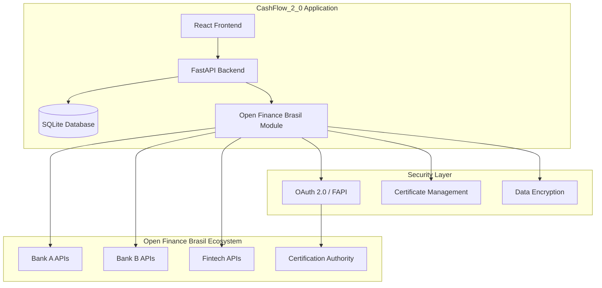

# Open Finance Brasil Architecture Documentation
## CashFlow_2_0 Integration Specification

### Overview

This document outlines the Open Finance Brasil (OFB) compliance architecture and integration strategy for the CashFlow_2_0 personal finance management application. The implementation follows the technical standards and specifications defined by the Open Finance Brasil governance structure.

**Reference Documentation**: [Open Finance Brasil Developer Area](https://openfinancebrasil.atlassian.net/wiki/spaces/OF/overview?homepageId=17367041)

---

## 1. Open Finance Brasil Framework

### 1.1 Regulatory Foundation

Open Finance Brasil is regulated by:
- **Banco Central do Brasil (BACEN)**
- **Conselho Monetário Nacional (CMN)**
- Multi-association governance structure including Febraban, ABBC, ACREFI, ABBI, OCB, Abecs, Abipag, Abranet, Câmara e-net, ABCD, and ABFintechs

### 1.2 Core Principles

1. **Data Portability**: Customers control their financial data
2. **Competition**: Promotes innovation in financial services
3. **Security**: Robust authentication and authorization
4. **Standardization**: Common APIs across all participants
5. **Transparency**: Clear data usage policies

---

## 2. CashFlow_2_0 Compliance Architecture

### 2.1 System Architecture Overview



### 2.2 Compliance Implementation Status

| Component | Status | OFB Standard | Implementation |
|-----------|--------|--------------|----------------|
| **Data Categories** | ✅ Compliant | Phase 1-4 | Complete 3-level hierarchy |
| **Transaction Types** | ✅ Compliant | RECEITA/DESPESA/TRANSFERENCIA/INVESTIMENTO | Implemented |
| **Currency Standards** | ✅ Compliant | BRL only | Enforced validation |
| **API Structure** | ✅ Compliant | RESTful + OpenAPI | FastAPI implementation |
| **Security Model** | 🚧 In Progress | OAuth 2.0 + FAPI | Planned for Phase 3 |
| **Consent Management** | 📋 Planned | Dynamic consent | Phase 4 implementation |

---

## 3. API Integration Specifications

### 3.1 Open Finance Brasil API Categories

CashFlow_2_0 supports integration with the following OFB API categories:

#### 3.1.1 Account Information APIs
- **Account Details**: Basic account information
- **Balances**: Real-time balance data
- **Transactions**: Historical transaction data
- **Overdrafts**: Credit facility information

#### 3.1.2 Payment Initiation APIs
- **PIX Integration**: Instant payment system
- **TED/DOC**: Traditional transfer methods
- **Scheduled Payments**: Future-dated transactions

#### 3.1.3 Credit Information APIs
- **Credit Cards**: Card transaction data
- **Loans**: Loan account information
- **Financing**: Vehicle/home financing data

### 3.2 CashFlow_2_0 API Endpoints

Our application exposes OFB-compliant endpoints:

```python
# Account Information
GET /api/v1/open-finance/accounts
GET /api/v1/open-finance/accounts/{accountId}/balances
GET /api/v1/open-finance/accounts/{accountId}/transactions

# Payment Initiation
POST /api/v1/open-finance/payments/pix
POST /api/v1/open-finance/payments/ted-doc

# Consent Management
POST /api/v1/open-finance/consents
GET /api/v1/open-finance/consents/{consentId}
DELETE /api/v1/open-finance/consents/{consentId}
```

---

## 4. Data Standards and Categories

### 4.1 Transaction Categorization (OFB Compliant)

Our implementation follows the Open Finance Brasil categorization standards:

```python
# Primary Categories (Level 1)
PRIMARY_CATEGORIES = {
    "RECEITAS": "Income transactions",
    "DESPESAS": "Expense transactions", 
    "TRANSFERENCIAS": "Transfer transactions",
    "INVESTIMENTOS": "Investment transactions"
}

# Secondary Categories (Level 2)  
SECONDARY_CATEGORIES = {
    "ALIMENTACAO": "Food and dining",
    "TRANSPORTE": "Transportation",
    "MORADIA": "Housing and utilities",
    "SAUDE": "Healthcare",
    "EDUCACAO": "Education",
    "LAZER": "Entertainment and leisure",
    "VESTUARIO": "Clothing and accessories",
    "SERVICOS": "Services",
    "OUTROS": "Other expenses"
}

# Detailed Categories (Level 3)
DETAILED_CATEGORIES = {
    "RESTAURANTES": "Restaurant meals",
    "SUPERMERCADO": "Grocery shopping",
    "COMBUSTIVEL": "Fuel and gas",
    "TRANSPORTE_PUBLICO": "Public transportation",
    # ... additional subcategories
}
```

### 4.2 Currency and Locale Standards

```python
# Open Finance Brasil Currency Standards
CURRENCY_STANDARDS = {
    "primary_currency": "BRL",
    "decimal_places": 2,
    "thousands_separator": ".",
    "decimal_separator": ",",
    "currency_symbol": "R$",
    "currency_position": "before",
    "locale": "pt_BR"
}
```

---

## 5. Security and Authentication

### 5.1 OAuth 2.0 + FAPI Implementation

```python
# OAuth 2.0 Configuration for Open Finance Brasil
OAUTH_CONFIG = {
    "authorization_endpoint": "https://auth.openfinancebrasil.org.br/oauth2/authorize",
    "token_endpoint": "https://auth.openfinancebrasil.org.br/oauth2/token",
    "scopes": [
        "accounts",
        "transactions", 
        "payments",
        "consents"
    ],
    "response_type": "code",
    "grant_type": "authorization_code"
}

# FAPI (Financial-grade API) Security Requirements
FAPI_REQUIREMENTS = {
    "tls_version": "1.2+",
    "certificate_bound_tokens": True,
    "pkce_required": True,
    "request_object_signing": True,
    "mtls_endpoint_aliases": True
}
```

### 5.2 Certificate Management

```python
# Certificate Management for Open Finance Brasil
CERTIFICATE_CONFIG = {
    "transport_certificate": "path/to/transport.pem",
    "signing_certificate": "path/to/signing.pem", 
    "encryption_certificate": "path/to/encryption.pem",
    "ca_bundle": "path/to/open_finance_ca.pem",
    "certificate_validation": True,
    "revocation_check": True
}
```

---

## 6. Implementation Roadmap

### Phase 1: Foundation ✅ COMPLETED
- Basic categorization system
- Transaction models
- API structure setup
- Local data management

### Phase 2: OFB Integration Setup 🚧 IN PROGRESS
- OAuth 2.0 implementation
- Certificate management
- Basic API connectivity
- Consent management framework

### Phase 3: Security Enhancement 📋 PLANNED
- FAPI compliance implementation
- Certificate-bound tokens
- Request object signing
- MTLS endpoint configuration

### Phase 4: Full Integration 📋 PLANNED
- Real-time bank data synchronization
- Payment initiation capabilities
- Multi-bank aggregation
- Advanced analytics with OFB data

---

## 7. Compliance Checklist

### 7.1 Technical Requirements

- [x] **API Standards**: RESTful APIs with OpenAPI specification
- [x] **Data Categories**: 3-level categorization hierarchy
- [x] **Currency Support**: BRL currency validation
- [x] **Transaction Types**: OFB standard transaction types
- [ ] **Security**: OAuth 2.0 + FAPI implementation
- [ ] **Certificates**: X.509 certificate management
- [ ] **Consent**: Dynamic consent management
- [ ] **Monitoring**: API performance monitoring

### 7.2 Regulatory Requirements

- [x] **Data Privacy**: Local-only data storage
- [x] **User Control**: Complete data ownership
- [ ] **Audit Trail**: Transaction logging
- [ ] **Data Retention**: Compliance with LGPD
- [ ] **Consent Records**: Detailed consent tracking
- [ ] **Error Handling**: Standardized error responses

---

## 8. Integration Examples

### 8.1 Bank Account Connection

```python
async def connect_bank_account(bank_code: str, user_consent: str):
    """Connect to bank account via Open Finance Brasil APIs"""
    
    # 1. Validate consent
    consent = await validate_consent(user_consent)
    
    # 2. Establish connection
    connection = await establish_bank_connection(
        bank_code=bank_code,
        consent_id=consent.id,
        scopes=["accounts", "transactions"]
    )
    
    # 3. Fetch account data
    accounts = await fetch_accounts(connection)
    
    # 4. Import transactions
    for account in accounts:
        transactions = await fetch_transactions(account.id)
        await import_transactions_to_local_db(transactions)
    
    return {"status": "connected", "accounts": len(accounts)}
```

### 8.2 Transaction Synchronization

```python
async def sync_transactions():
    """Synchronize transactions from connected banks"""
    
    for connection in get_active_connections():
        try:
            # Fetch new transactions
            last_sync = get_last_sync_date(connection)
            new_transactions = await fetch_transactions_since(
                connection, last_sync
            )
            
            # Process and categorize
            for transaction in new_transactions:
                categorized = await auto_categorize_transaction(transaction)
                await save_transaction(categorized)
            
            # Update sync timestamp
            await update_last_sync(connection, datetime.utcnow())
            
        except Exception as e:
            logger.error(f"Sync failed for {connection.bank}: {e}")
```

---

## 9. Error Handling and Monitoring

### 9.1 OFB Standard Error Responses

```json
{
  "errors": [
    {
      "code": "INVALID_CONSENT",
      "title": "Invalid Consent",
      "detail": "The provided consent is expired or revoked",
      "meta": {
        "timestamp": "2024-01-15T10:30:00Z",
        "requestId": "abc123"
      }
    }
  ]
}
```

### 9.2 Monitoring and Analytics

```python
# API Performance Monitoring
MONITORING_CONFIG = {
    "response_time_threshold": 5000,  # ms
    "error_rate_threshold": 1,  # %
    "availability_target": 99.5,  # %
    "rate_limit_monitoring": True,
    "certificate_expiry_alerts": True
}
```

---

## 10. Future Enhancements

### 10.1 Advanced Features
- **Real-time Notifications**: Bank transaction alerts
- **Smart Budgeting**: AI-powered budget recommendations
- **Investment Tracking**: Portfolio management integration
- **Credit Monitoring**: Credit score and history tracking

### 10.2 Ecosystem Integration
- **PIX Integration**: Complete instant payment support
- **Open Insurance**: Insurance product integration
- **Open Investment**: Investment platform connectivity
- **PFM Services**: Personal Financial Management APIs

---

## References

1. [Open Finance Brasil Developer Area](https://openfinancebrasil.atlassian.net/wiki/spaces/OF/overview?homepageId=17367041)
2. Brazilian Central Bank Regulations
3. OAuth 2.0 and FAPI Specifications
4. Open Finance Brasil Technical Standards
5. LGPD Compliance Guidelines

---

**Document Version**: 1.0  
**Last Updated**: January 2024  
**Status**: Active Development  
**Compliance Level**: Phase 1 Complete, Phase 2 In Progress
