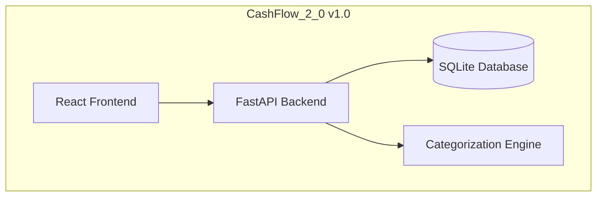
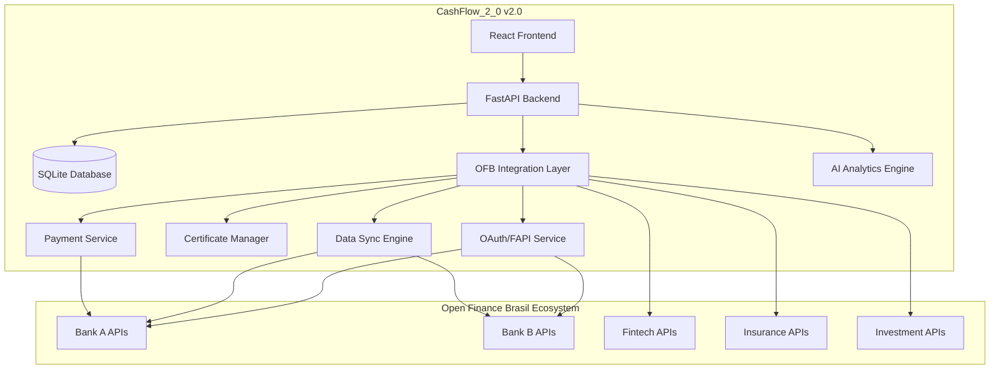

# Open Finance Brasil Implementation Roadmap
## CashFlow_2_0 Integration Strategy

### Executive Summary

This document outlines the implementation roadmap for integrating CashFlow_2_0 with the Open Finance Brasil ecosystem. Based on the official specifications from [Open Finance Brasil Developer Area](https://openfinancebrasil.atlassian.net/wiki/spaces/OF/overview?homepageId=17367041), this roadmap ensures full compliance with Brazilian financial regulations while maintaining our local-first privacy approach.

---

## 1. Current Implementation Status

### ✅ Phase 1: Foundation (COMPLETED)
**Status**: 100% Complete  
**Compliance Level**: Basic OFB Standards  

#### Achievements:
- [x] **Transaction Categorization**: 3-level hierarchy compliant with OFB standards
- [x] **Data Models**: Complete SQLAlchemy models for transactions, categories, budgets
- [x] **Currency Standards**: BRL-only validation and formatting
- [x] **API Structure**: FastAPI framework with OpenAPI documentation
- [x] **Security Foundation**: Basic authentication and authorization framework
- [x] **Local Data Management**: SQLite database with privacy-first approach

#### Technical Deliverables:
```
✅ Open Finance Brasil Category Hierarchy
✅ Transaction Types (RECEITA, DESPESA, TRANSFERENCIA, INVESTIMENTO)
✅ Currency Validation (BRL only)
✅ RESTful API Design
✅ Data Privacy Controls
✅ Local Database Schema
```

---

## 2. Implementation Phases

### 🚧 Phase 2: OFB Infrastructure Setup (CURRENT)
**Timeline**: 4-6 weeks  
**Priority**: High  
**Compliance Level**: OAuth 2.0 + Basic FAPI  

#### Objectives:
- [ ] **OAuth 2.0 Implementation**: Complete authorization flow
- [ ] **Certificate Management**: X.509 certificate handling
- [ ] **Consent Management**: Dynamic consent lifecycle
- [ ] **Basic API Connectivity**: Connect to OFB sandbox
- [ ] **Error Handling**: Standardized OFB error responses

#### Technical Requirements:

```python
# OAuth 2.0 + FAPI Configuration
PHASE_2_REQUIREMENTS = {
    "authentication": {
        "oauth_version": "2.0",
        "security_profile": "FAPI 1.0",
        "pkce_required": True,
        "mtls_required": True
    },
    "certificates": {
        "transport_cert": "Required for MTLS",
        "signing_cert": "Required for request signing",
        "encryption_cert": "Required for data encryption"
    },
    "consent_management": {
        "dynamic_consent": True,
        "granular_permissions": True,
        "consent_lifecycle": True
    }
}
```

#### Deliverables:
1. **OFB Authentication Service**
   - OAuth 2.0 authorization flow
   - Token management and refresh
   - Certificate-bound tokens

2. **Consent Management System**
   - Consent creation and validation
   - Permission granularity
   - Consent revocation

3. **Certificate Infrastructure**
   - Certificate loading and validation
   - MTLS client configuration
   - Certificate expiry monitoring

4. **API Client Framework**
   - Base HTTP client with MTLS
   - Request signing capability
   - Standardized error handling

### 📋 Phase 3: Account Information Integration (PLANNED)
**Timeline**: 6-8 weeks  
**Priority**: High  
**Compliance Level**: Full Account Information APIs  

#### Objectives:
- [ ] **Account Discovery**: Connect and list bank accounts
- [ ] **Balance Retrieval**: Real-time balance information
- [ ] **Transaction History**: Import historical transactions
- [ ] **Data Synchronization**: Automated data sync scheduler
- [ ] **Multi-Bank Support**: Support multiple bank connections

#### Technical Specifications:

```python
# Account Information API Integration
PHASE_3_APIS = {
    "accounts": {
        "endpoint": "/accounts",
        "methods": ["GET"],
        "permissions": ["accounts"]
    },
    "balances": {
        "endpoint": "/accounts/{accountId}/balances",
        "methods": ["GET"],
        "permissions": ["accounts"]
    },
    "transactions": {
        "endpoint": "/accounts/{accountId}/transactions",
        "methods": ["GET"],
        "permissions": ["transactions"],
        "pagination": True,
        "date_filtering": True
    }
}
```

#### Features:
1. **Bank Account Management**
   - Account discovery and listing
   - Account type identification
   - Balance monitoring

2. **Transaction Import Engine**
   - Bulk transaction import
   - Duplicate detection
   - Auto-categorization integration

3. **Data Synchronization**
   - Scheduled sync jobs
   - Real-time balance updates
   - Transaction monitoring

4. **Multi-Bank Aggregation**
   - Multiple consent management
   - Unified transaction view
   - Cross-bank analytics

### 📋 Phase 4: Payment Initiation (PLANNED)
**Timeline**: 8-10 weeks  
**Priority**: Medium  
**Compliance Level**: Full Payment Initiation APIs  

#### Objectives:
- [ ] **PIX Integration**: Instant payment support
- [ ] **Traditional Payments**: TED/DOC integration
- [ ] **Payment Scheduling**: Future-dated payments
- [ ] **Payment Tracking**: Status monitoring and updates
- [ ] **Security Controls**: Enhanced payment security

#### Payment Types Support:

```python
# Payment Initiation Capabilities
PHASE_4_PAYMENTS = {
    "pix": {
        "instant_payments": True,
        "qr_code_support": True,
        "pix_key_support": True,
        "dynamic_qr": True
    },
    "traditional": {
        "ted_support": True,
        "doc_support": True,
        "scheduled_payments": True,
        "recurring_payments": True
    },
    "security": {
        "two_factor_auth": True,
        "transaction_limits": True,
        "fraud_detection": True
    }
}
```

### 📋 Phase 5: Advanced Features (FUTURE)
**Timeline**: 12-16 weeks  
**Priority**: Low  
**Compliance Level**: Full OFB Ecosystem  

#### Objectives:
- [ ] **Credit Information**: Loan and credit card data
- [ ] **Investment Integration**: Investment account support
- [ ] **Open Insurance**: Insurance product integration
- [ ] **AI Analytics**: Advanced financial insights
- [ ] **Marketplace Integration**: Third-party service connections

---

## 3. Technical Architecture Evolution

### Current Architecture (Phase 1)


### Target Architecture (Phase 5)


---

## 4. Compliance Timeline

### Regulatory Milestones

| Phase | OFB Compliance Level | Regulatory Requirements | Target Date |
|-------|---------------------|------------------------|-------------|
| **Phase 1** ✅ | Basic Standards | Category hierarchy, currency validation | Completed |
| **Phase 2** 🚧 | OAuth 2.0 + FAPI | Authentication, consent management | Q2 2024 |
| **Phase 3** 📋 | Account Information | Account data access, transaction import | Q3 2024 |
| **Phase 4** 📋 | Payment Initiation | PIX integration, payment services | Q4 2024 |
| **Phase 5** 📋 | Full Ecosystem | Credit, investments, insurance | Q1 2025 |

### Certification Requirements

```python
# OFB Certification Checklist
CERTIFICATION_REQUIREMENTS = {
    "technical_standards": {
        "api_compliance": "OpenAPI 3.0 specification",
        "security_profile": "FAPI 1.0 Advanced",
        "certificate_management": "X.509 PKI infrastructure",
        "oauth_implementation": "OAuth 2.0 with PKCE"
    },
    "security_requirements": {
        "data_encryption": "TLS 1.2+ for transport",
        "certificate_binding": "Certificate-bound access tokens",
        "request_signing": "JWS request object signing",
        "mtls_enforcement": "Mutual TLS for all API calls"
    },
    "operational_requirements": {
        "availability_sla": "99.5% uptime requirement",
        "response_time_sla": "< 5 seconds for 95% of requests",
        "rate_limiting": "Compliant with OFB rate limits",
        "monitoring": "Real-time API monitoring"
    }
}
```

---

## 5. Security Implementation Strategy

### Security Evolution by Phase

#### Phase 2: Foundation Security
```python
# Basic Security Implementation
PHASE_2_SECURITY = {
    "oauth_2_0": {
        "authorization_code_flow": True,
        "pkce_protection": True,
        "state_parameter": True,
        "nonce_parameter": True
    },
    "certificate_management": {
        "x509_certificates": True,
        "certificate_validation": True,
        "expiry_monitoring": True
    },
    "transport_security": {
        "tls_1_2_minimum": True,
        "mtls_client_auth": True,
        "certificate_pinning": True
    }
}
```

#### Phase 3: Enhanced Security
```python
# Enhanced Security Features
PHASE_3_SECURITY = {
    "fapi_compliance": {
        "certificate_bound_tokens": True,
        "request_object_signing": True,
        "mtls_endpoint_aliases": True,
        "jarm_response_mode": True
    },
    "consent_security": {
        "granular_permissions": True,
        "consent_binding": True,
        "revocation_mechanisms": True,
        "audit_trail": True
    },
    "data_protection": {
        "field_level_encryption": True,
        "data_anonymization": True,
        "retention_policies": True,
        "lgpd_compliance": True
    }
}
```

### Security Monitoring Dashboard

```python
# Security Metrics Monitoring
SECURITY_METRICS = {
    "authentication": {
        "failed_login_attempts": "< 1% of total attempts",
        "token_refresh_rate": "Monitor for anomalies",
        "certificate_expiry": "Alert 30 days before expiry"
    },
    "api_security": {
        "request_signing_failures": "< 0.1% of requests",
        "certificate_validation_errors": "Zero tolerance",
        "rate_limit_violations": "Monitor and alert"
    },
    "data_protection": {
        "encryption_status": "100% of sensitive data",
        "consent_compliance": "100% of data access",
        "audit_log_integrity": "Tamper-proof logging"
    }
}
```

---

## 6. Integration Testing Strategy

### Testing Phases

#### Phase 2 Testing: Authentication & Consent
```python
# OAuth 2.0 + FAPI Testing Suite
PHASE_2_TESTS = {
    "oauth_flow_tests": [
        "authorization_code_flow",
        "pkce_validation",
        "state_parameter_validation",
        "token_exchange",
        "token_refresh",
        "token_revocation"
    ],
    "certificate_tests": [
        "certificate_loading",
        "certificate_validation",
        "mtls_handshake",
        "certificate_expiry_handling"
    ],
    "consent_tests": [
        "consent_creation",
        "consent_validation",
        "consent_revocation",
        "permission_enforcement"
    ]
}
```

#### Phase 3 Testing: API Integration
```python
# Account Information API Testing
PHASE_3_TESTS = {
    "account_api_tests": [
        "account_discovery",
        "account_details_retrieval",
        "balance_information",
        "transaction_history",
        "pagination_handling",
        "error_scenarios"
    ],
    "data_sync_tests": [
        "initial_sync",
        "incremental_sync",
        "duplicate_detection",
        "categorization_accuracy",
        "sync_failure_recovery"
    ]
}
```

### Sandbox Environment Setup

```python
# OFB Sandbox Configuration
SANDBOX_CONFIG = {
    "base_url": "https://sandbox.openfinancebrasil.org.br",
    "auth_server": "https://auth.sandbox.openfinancebrasil.org.br",
    "directory_server": "https://directory.sandbox.openfinancebrasil.org.br",
    "test_certificates": {
        "transport_cert": "/certs/sandbox/transport.pem",
        "signing_cert": "/certs/sandbox/signing.pem"
    },
    "test_data": {
        "test_accounts": ["test-account-1", "test-account-2"],
        "test_transactions": "Sample transaction dataset",
        "test_balances": "Mock balance data"
    }
}
```

---

## 7. Risk Management and Mitigation

### Technical Risks

| Risk Category | Risk Description | Impact | Probability | Mitigation Strategy |
|---------------|------------------|---------|-------------|-------------------|
| **Security** | Certificate expiry | High | Medium | Automated monitoring + 30-day alerts |
| **Integration** | API rate limiting | Medium | High | Implement exponential backoff + caching |
| **Compliance** | Regulation changes | High | Medium | Subscribe to OFB updates + flexible architecture |
| **Performance** | Slow API responses | Medium | Medium | Connection pooling + timeout handling |
| **Data** | Sync failures | Medium | Medium | Retry mechanisms + manual sync options |

### Business Risks

| Risk Category | Risk Description | Impact | Mitigation Strategy |
|---------------|------------------|---------|-------------------|
| **User Adoption** | Complex setup process | High | Simplified onboarding flow |
| **Privacy Concerns** | Data sharing reluctance | Medium | Clear privacy controls + local-first approach |
| **Bank Support** | Limited bank participation | Medium | Gradual rollout + major bank prioritization |
| **Regulatory** | Compliance failures | High | Regular compliance audits + legal review |

---

## 8. Success Metrics and KPIs

### Technical Metrics

```python
# Performance KPIs
TECHNICAL_KPIS = {
    "api_performance": {
        "response_time_p95": "< 2 seconds",
        "availability": "> 99.5%",
        "error_rate": "< 1%"
    },
    "security_metrics": {
        "authentication_success_rate": "> 99.9%",
        "certificate_compliance": "100%",
        "security_incidents": "Zero tolerance"
    },
    "integration_quality": {
        "data_accuracy": "> 99.5%",
        "sync_success_rate": "> 99%",
        "categorization_accuracy": "> 95%"
    }
}
```

### Business Metrics

```python
# Business KPIs
BUSINESS_KPIS = {
    "user_adoption": {
        "bank_connection_rate": "> 70% of users",
        "daily_active_users": "Growth target",
        "user_retention": "> 80% monthly"
    },
    "financial_insights": {
        "categorization_accuracy": "> 95%",
        "budget_adherence": "User improvement metrics",
        "financial_goal_achievement": "Success rate tracking"
    },
    "compliance": {
        "lgpd_compliance_rate": "100%",
        "ofb_certification_status": "Maintained",
        "audit_findings": "Zero critical issues"
    }
}
```

---

## 9. Resource Requirements

### Development Team

| Role | Phase 2 | Phase 3 | Phase 4 | Phase 5 |
|------|---------|---------|---------|---------|
| **Backend Developer** | 1.0 FTE | 1.5 FTE | 1.0 FTE | 1.0 FTE |
| **Security Engineer** | 0.5 FTE | 1.0 FTE | 0.5 FTE | 0.5 FTE |
| **Frontend Developer** | 0.5 FTE | 1.0 FTE | 1.0 FTE | 1.0 FTE |
| **DevOps Engineer** | 0.5 FTE | 0.5 FTE | 0.5 FTE | 0.5 FTE |
| **QA Engineer** | 0.5 FTE | 1.0 FTE | 1.0 FTE | 0.5 FTE |

### Infrastructure Requirements

```python
# Infrastructure Scaling Plan
INFRASTRUCTURE_PLAN = {
    "phase_2": {
        "compute": "2 vCPU, 4GB RAM",
        "storage": "50GB SSD",
        "certificates": "Sandbox certificates",
        "monitoring": "Basic monitoring"
    },
    "phase_3": {
        "compute": "4 vCPU, 8GB RAM",
        "storage": "100GB SSD",
        "certificates": "Production certificates",
        "monitoring": "Enhanced monitoring + alerting"
    },
    "phase_4": {
        "compute": "8 vCPU, 16GB RAM",
        "storage": "200GB SSD",
        "load_balancing": "Required",
        "security": "Enhanced security monitoring"
    },
    "phase_5": {
        "compute": "Auto-scaling group",
        "storage": "500GB+ distributed storage",
        "high_availability": "Multi-region deployment",
        "monitoring": "Full observability stack"
    }
}
```

---

## 10. Conclusion and Next Steps

### Immediate Actions (Next 30 Days)

1. **[Week 1-2]** Complete OAuth 2.0 implementation framework
2. **[Week 2-3]** Set up certificate management infrastructure  
3. **[Week 3-4]** Implement basic consent management system
4. **[Week 4]** Begin OFB sandbox integration testing

### Medium-term Goals (3-6 Months)

1. **Complete Phase 2**: Full authentication and consent management
2. **Begin Phase 3**: Account information API integration
3. **User Testing**: Beta testing with selected users
4. **Security Audit**: Independent security assessment

### Long-term Vision (6-12 Months)

1. **Full OFB Integration**: Complete payment initiation capabilities
2. **Multi-Bank Support**: Support for major Brazilian banks
3. **Advanced Analytics**: AI-powered financial insights
4. **Ecosystem Expansion**: Integration with insurance and investment platforms

### Success Indicators

- ✅ **Phase 2 Complete**: OAuth 2.0 + FAPI implementation
- ✅ **Sandbox Integration**: Successful OFB sandbox connectivity
- ✅ **Security Certification**: Independent security audit passed
- ✅ **User Adoption**: 1000+ active users with bank connections
- ✅ **Compliance**: Full OFB certification achieved

---

**Document Version**: 1.0  
**Last Updated**: January 2024  
**Review Schedule**: Monthly  
**Stakeholders**: Development Team, Security Team, Compliance Team  
**Approval Status**: Pending Review

---

## References

1. [Open Finance Brasil Developer Portal](https://openfinancebrasil.atlassian.net/wiki/spaces/OF/overview?homepageId=17367041)
2. [FAPI 1.0 Security Profile Specification](https://openid.net/specs/openid-financial-api-part-1-1_0.html)
3. [OAuth 2.0 Security Best Practices](https://tools.ietf.org/html/draft-ietf-oauth-security-topics)
4. [Brazilian Central Bank Regulations - Resolution 4,658/2018](https://www.bcb.gov.br/estabilidadefinanceira/exibenormativo?tipo=Resolu%C3%A7%C3%A3o&numero=4658)
5. [LGPD Compliance Guidelines](https://www.gov.br/cidadania/pt-br/acesso-a-informacao/lgpd)
